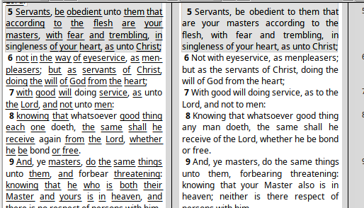
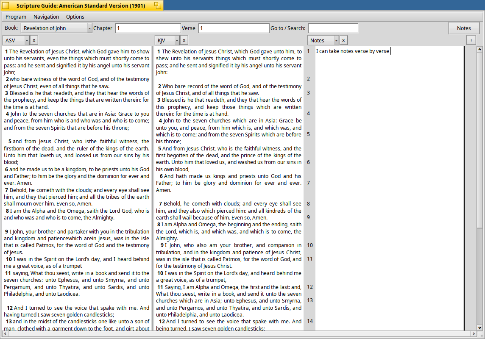
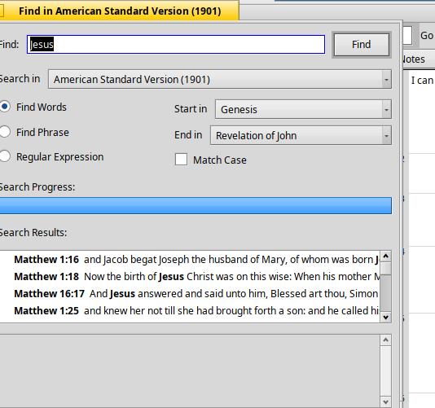
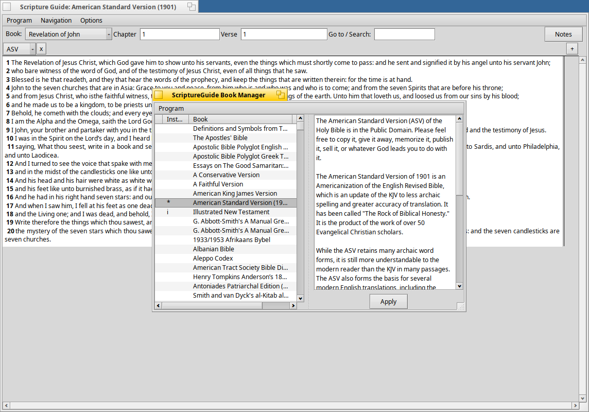

# ScriptureGuide

A Bible study program for [Haiku](https://www.haiku-os.org/), built on the
[SWORD library](http://www.crosswire.org/sword/) and licensed under the
GPL v2. Formerly Be-Logos.

Read several translations side by side, verse aligned, with your own notes
in a column of their own — and a Book Manager for downloading the Bibles,
commentaries and dictionaries CrossWire publishes.

**Current release: 1.2.2** (test release) — [download the
package](https://github.com/Paradoxianer/ScriptureGuide/releases/latest) ·
[changelog](CHANGELOG.md)

## What it does

**Columns, aligned on the verse.** Any number of translations, commentaries
and notes columns side by side. However differently the translations wrap,
the same verse sits at the same height in every one of them.

**Column groups.** Columns are joined into groups that scroll and navigate
together — or split apart, so one group can sit in the Old Testament while
another stays in the New. Each group keeps its own chapter, scroll position
and alignment. The layout is restored the next time you start.

**Notes that live beside the verse.** A notes column is edited directly:
click where you want to type, select and copy across verses, walk from one
verse's note into the next with the arrow keys. Notes save themselves as
you type, and are stored as a SWORD module of their own.

**Cross-references and Strong's numbers.** References in commentary or note
text become links; Strong's-tagged words open a dictionary window. Back and
forward step through where you have been, so following a link never costs
you your place.

**One field for going and finding.** Type a reference into *Go to / Search*
and it jumps there; type anything else and it searches. Searching covers the
translations you actually have open, and can be narrowed to a range of
books, made case-sensitive, or given a regular expression.

**Drag and drop.** Drag a selection between columns, onto the Desktop as a
clipping, or into another application — and drag a reference back in to
navigate there.

**Copy Comparison.** Every open column's text for the current chapter, as a
verse-by-verse table, on the clipboard as plain text, tab-separated,
Markdown or HTML.

**In your language.** The interface is translated into German, Spanish,
French, Croatian, Dutch, Romanian and Russian. Verse references follow local
convention too — a German system reads and writes `Johannes 3, 16` rather
than `John 3:16`.

## Book Manager

Available modules on the left, installed on the right. Move one across and
the work starts; removal asks first. Every column sorts, including type, so
dictionaries are findable among several hundred Bibles.

## Installing

**A package**, from the
[releases page](https://github.com/Paradoxianer/ScriptureGuide/releases/latest):

    pkgman install scriptureguide-1.2.2-1-x86_64.hpkg

**Build your own package.** A prebuilt `.hpkg` records the Haiku version it
was built on and may refuse to install on another. `package.sh` builds one
that matches your machine, and needs nothing present but itself:

    sh package.sh v1.2.2

It installs the build dependencies, fetches the source, builds both
applications, writes the `.hpkg` into the current directory and removes what
it created. Add `--install` to install it straight away.

**Without a package**, `install.sh` builds a tagged release and installs it
into `~/apps/ScriptureGuide` with Desktop shortcuts.

## Building from a checkout

Haiku only.

    cd ScriptureGuide && make && make bindcatalogs
    cd ../ScriptureGuideManager && make && make bindcatalogs

`make bindcatalogs` embeds the translations from `locales/*.catkeys`;
without it the interface stays English whatever the system language. Both
binaries end up in `App/`.

Tests are under `ScriptureGuide/tests/` — `make` there builds and runs a
headless regression suite. Build the application first: the tests' makefile
reaches into `../` for sources, which puts `..` on make's VPATH, and VPATH
applies to targets as well, so it will otherwise find the application's
objects and compile nothing of its own.

Diagnostics are off unless asked for:

    SG_DEBUG=1 ./ScriptureGuide

## Documentation

The manual is in `App/docs`, in [English](App/docs/index.html) and
[German](App/docs/index_de.html). `App/README.htm` is the short in-app
welcome page.

## Requirements

The SWORD library, and `awk`, `unzip` and `wget` for the Book Manager until
downloading is done another way. `package.sh` and `install.sh` install these
for you.
